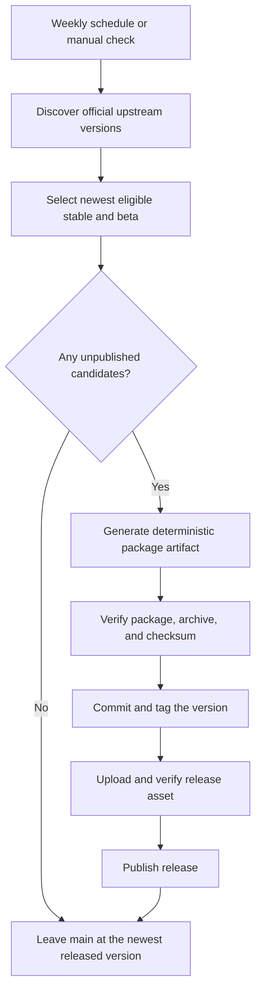

# Automatic VLCKit Releases

## Problem Frame

The package should stay current with VideoLAN without requiring a maintainer to
look up versions, run local packaging commands, or manually create releases.
The repository is primarily for personal use, so it should publish only the
most useful current releases instead of backfilling every missed upstream
version.

## Requirements

**Discovery and selection**

- R1. The system must check official VideoLAN distribution sources once per
  week and when manually triggered; neither trigger requires a version input.
- R2. A candidate version is eligible only when matching MobileVLCKit,
  TVVLCKit, and VLCKit artifacts all exist upstream.
- R3. Each run may select at most the newest unpublished stable version and the
  newest unpublished beta version; older missing releases must not be
  backfilled.
- R4. A beta is eligible only when it is semantically newer than the newest
  upstream stable version. Historical betas older than or equal to the newest
  stable must be ignored.
- R5. When both candidates are eligible, they must be processed in ascending
  semantic-version order so that the last commit on `main` is the newest
  release overall.

**Version identity**

- R6. Stable package tags must exactly match VideoLAN's stable version, such as
  `3.7.3`.
- R7. VideoLAN beta identifiers that are not valid Semantic Versioning must be
  normalized only where SwiftPM requires it. For example, upstream `3.8.0b1`
  becomes SwiftPM/Git tag `3.8.0-b1`; release titles and metadata retain the
  original upstream identifier.
- R8. Stable and beta releases must be selectable as exact SwiftPM package
  versions. SwiftPM must not select beta releases implicitly for consumers that
  request stable version ranges.

**Generation and publication**

- R9. For each selected candidate, the system must discover the exact upstream
  filenames, build the combined XCFramework archive, update `Package.swift`,
  commit the package definition, create its version tag, upload the archive,
  verify the uploaded asset, and publish the GitHub release without manual
  intervention.
- R10. Generated archives must be deterministic: identical upstream inputs and
  generator code must produce the same archive checksum across repeated runs.
- R11. A release must remain unpublished until its archive integrity and
  SHA-256 digest match the checksum committed in `Package.swift`.
- R12. `main` must always finish at the newest version published by the
  automation, including a beta when that beta is newer than the newest stable.
- R13. Release metadata must identify the original VideoLAN version and the
  exact upstream artifacts used to build it.

**Safety and recovery**

- R14. A run with no eligible unpublished version must succeed without changing
  Git history or release state.
- R15. Concurrent release runs must be prevented.
- R16. Published tags and releases must never be silently moved, overwritten,
  or replaced. An already complete matching release is skipped.
- R17. An interrupted unpublished release must be safely resumable using the
  deterministic artifact. Any inconsistent existing tag, commit, checksum, or
  release asset must stop publication with a visible workflow failure.
- R18. Automation credentials must be scoped to this repository and limited to
  the permissions required to commit, tag, and manage releases.

## Success Criteria

- A new eligible VideoLAN release is automatically available as a valid SwiftPM
  version after the next weekly run.
- A manual run with no input performs the same discovery and publication flow.
- A run never builds more than two upstream versions.
- Repeated runs against unchanged upstream state make no repository changes.
- The release archive digest always matches the checksum in the corresponding
  tagged `Package.swift`.
- `main` and the newest version tag point to the newest package version released
  by this repository.

## Scope Boundaries

- Do not backfill every historical or skipped VideoLAN release.
- Do not publish a historical beta that is older than or equal to the newest
  stable release.
- Do not use paid larger GitHub-hosted runners.
- Do not store the generated 700+ MB archive in Git or as an Actions workflow
  artifact; it belongs directly on the GitHub release.
- Do not require a personal access token when the repository-scoped Actions
  token can perform the work.

## Key Decisions

- Weekly cadence: upstream releases are infrequent, so daily checks add little
  value.
- Maximum two candidates: personal use does not justify spending runner time on
  historical backfills.
- Betas supported through SemVer normalization: this makes them easy to select
  explicitly in SwiftPM without changing their upstream identity in metadata.
- `main` follows the newest version, including betas: version stability is
  represented by immutable tags, not by the default branch.
- Fully automatic publication: a public repository can use a standard hosted
  macOS runner without billed minutes, while release assets can hold the large
  generated archive directly.

## Dependencies / Assumptions

- VideoLAN continues publishing discoverable archives for all three supported
  VLCKit variants.
- Standard GitHub-hosted macOS runners remain available to this public
  repository.
- GitHub release assets continue allowing the generated archive size.

## Resolved Implementation Questions

- The production and unstable VideoLAN CocoaPods indexes are both inspected.
  The selector supports three-component stable versions and VideoLAN's `bN`
  beta suffix, ignores incomplete or ambiguous artifact sets, and prefers the
  production index when a version appears in both.
- Deterministic ZIP creation normalizes member timestamps, sorts the member
  list, strips extra attributes, and preserves symlinks. Regression tests
  compare repeated SHA-256 digests and extract the archive to verify symlinks.
- Publication uses an immutable tag plus a draft release as its resumable
  boundary. Existing published releases are verified and skipped; draft or
  tag-only states are regenerated and compared; any mismatch fails without
  moving a tag or replacing an asset.
